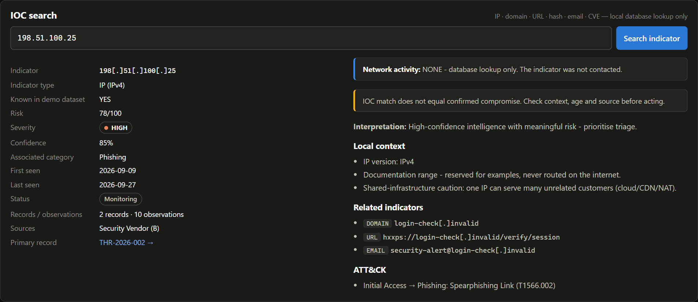
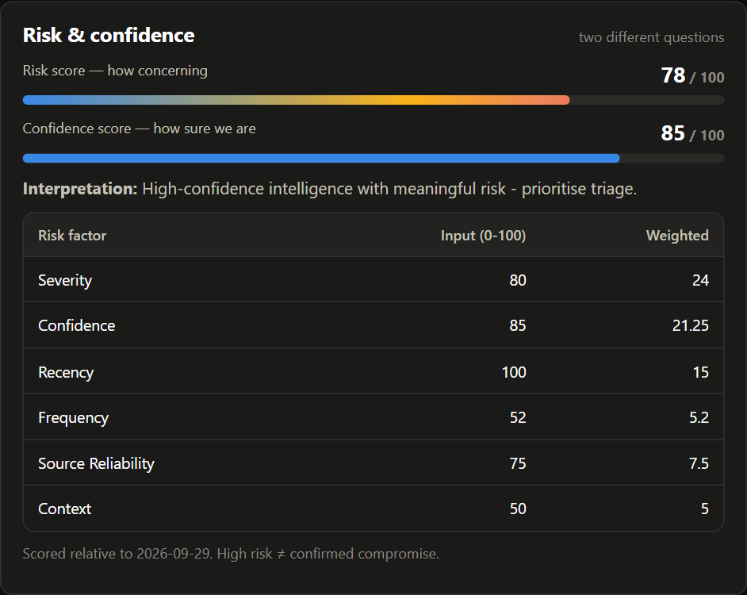
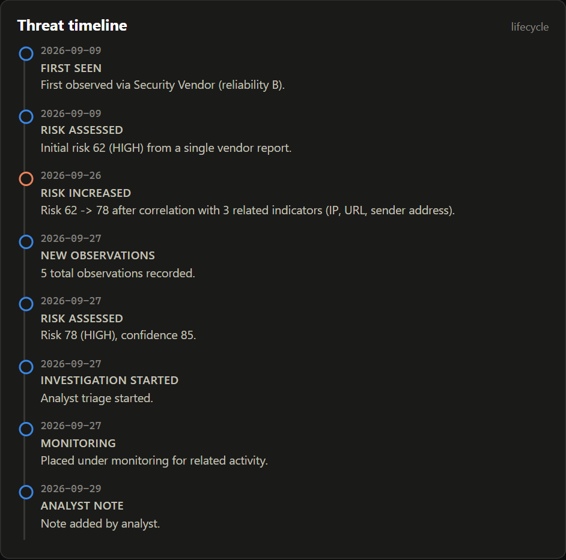
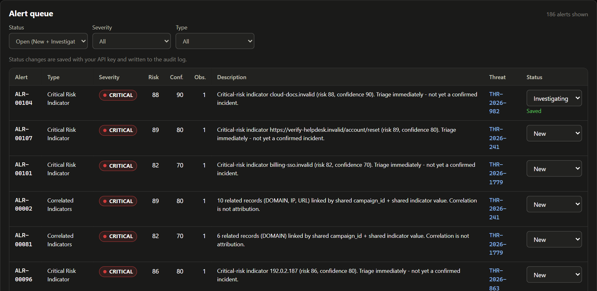
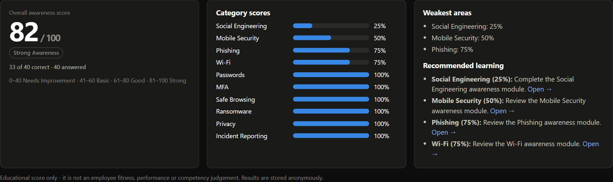
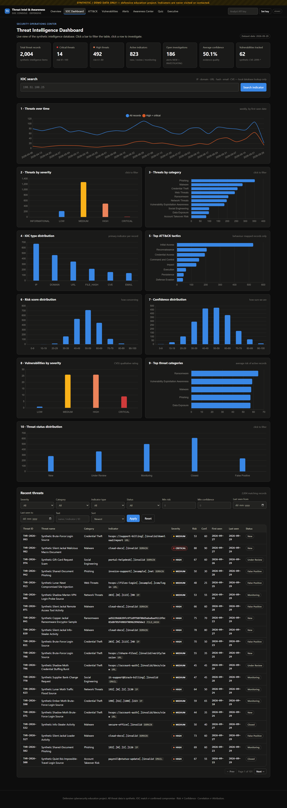
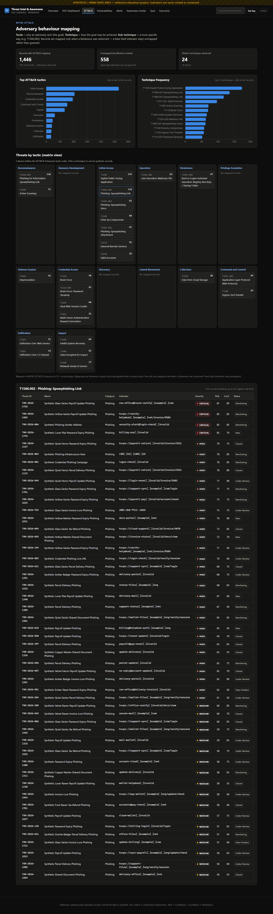
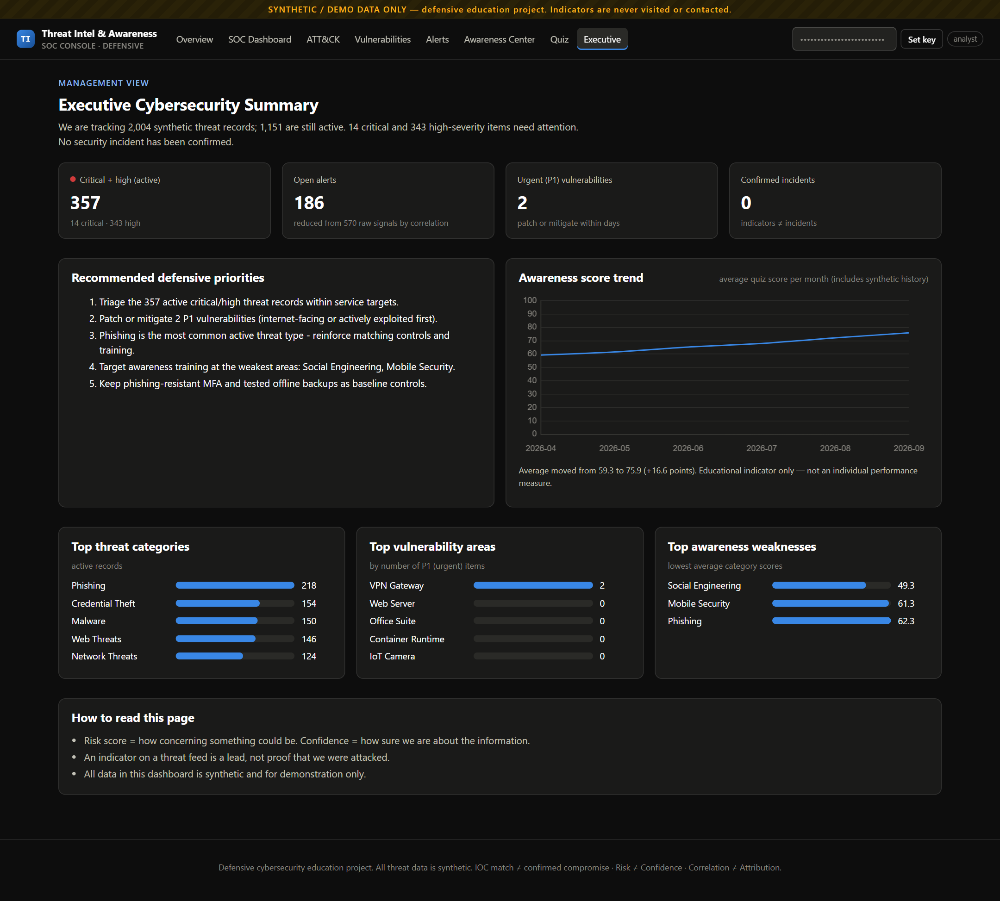
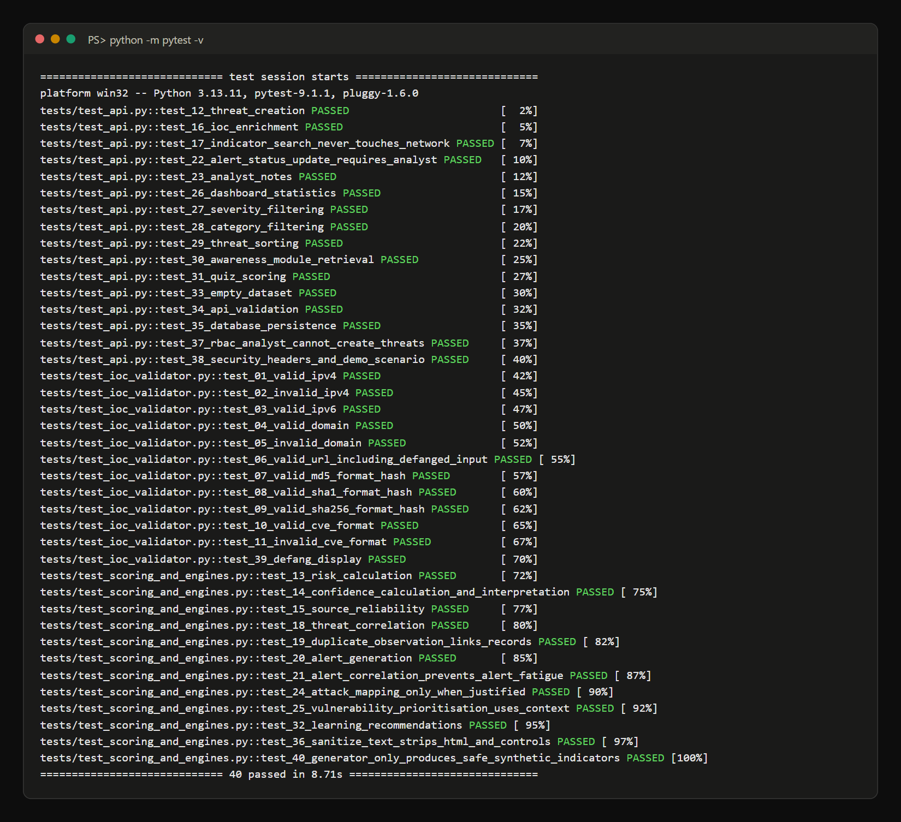
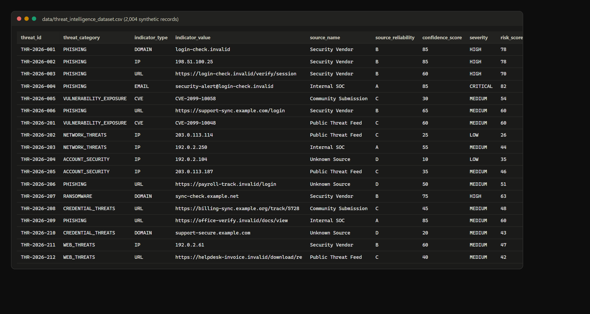

# Cybersecurity Awareness & Threat Intelligence Dashboard


> Defensive cybersecurity dashboard combining threat intelligence, IOC analysis, risk and confidence scoring, ATT&CK mapping, vulnerability awareness, SOC workflows, and interactive cybersecurity awareness training.

---

## Overview
A SOC-style web application that **collects, validates, enriches, scores, correlates, maps and explains** synthetic threat intelligence, and **teaches people** to recognise the same threats. It works completely offline, uses only safe synthetic indicators, and **never visits, resolves, scans or contacts** any indicator.

## Problem Statement
Security teams drown in indicators of uneven quality, duplicate alerts cause fatigue, patching is often driven by CVSS alone, IOC matches get mistaken for confirmed breaches, and awareness training is disconnected from the threats an organisation actually sees.

## Objectives
- Build a safe synthetic intelligence feed (2,004 records) and a reproducible ingestion pipeline.
- Validate IOC **syntax** (not maliciousness) for IP, domain, URL, hash, email and CVE.
- Score **risk** and **confidence** separately, with **source reliability** grades.
- Map observed **behaviours** to MITRE ATT&CK, and never guess.
- Correlate related indicators, generate alerts and reduce alert fatigue.
- Prioritise vulnerabilities with context, not CVSS alone.
- Provide awareness modules, a quiz, an awareness score and learning recommendations.
- Present an executive summary that non-technical stakeholders understand.

## Cybersecurity Relevance
The project mirrors real SOC and CTI work in banks, cloud providers, MSSPs, healthcare, government and universities, and demonstrates skills for **SOC Analyst, Threat Intelligence Analyst, Incident Response Analyst, Vulnerability Analyst, Security Engineer, Threat Hunter and Security Awareness Specialist** roles. See [docs/01_CONCEPTS.md](docs/01_CONCEPTS.md#3-industry-relevance).

## Features
| Area | What you get |
|---|---|
| Threat intelligence feed | 2,004 synthetic records, 10 categories, 6 indicator types, 6 sources with A–D reliability |
| IOC dashboard | 7 KPI cards, 10 interactive charts, evidence ladder (Observation → Indicator → Alert → Threat → Incident) |
| IOC search | IP / domain / URL / hash / email / CVE, accepts defanged input, **database lookup only** |
| Enrichment | First/last seen, categories, sources, related indicators, alerts, ATT&CK, analyst notes |
| Scoring | Explainable risk (6 weighted factors) + confidence + interpretation |
| Correlation | Union-find clusters by campaign / shared indicator, with a "not attribution" warning |
| MITRE ATT&CK | Tactic & technique charts, matrix view, click-through to records, justification per mapping |
| Vulnerabilities | CVE/CVSS awareness, contextual P1–P4 priority, interactive calculator |
| Alerts | 6 alert rules, alert de-duplication (570 → 470), triage statuses, audit log |
| Investigation view | Risk breakdown, timeline, related threats/alerts, analyst notes, status changes, recommended actions |
| Awareness Center | 15 modules + incident-response lifecycle & checklist |
| Quiz | 40 questions, awareness score & band, category scores, weakest areas, recommended modules |
| Executive summary | Plain-language headline, priorities, awareness trend, top weaknesses |
| Security | API-key RBAC, audit log, CSP, XSS-safe rendering, input validation, rate limiting, secrets in `.env` |

## Architecture
```
Synthetic Threat Data → Ingestion → Normalization → IOC Validation → Enrichment
   → Risk + Confidence → Correlation → { Threat DB | Alert Engine | ATT&CK Mapping }
   → SOC Dashboard → Analyst

Awareness Content → Learning Modules → Quiz Engine → Awareness Score → Recommendations
```
Full diagram and folder guide: [docs/02_ARCHITECTURE.md](docs/02_ARCHITECTURE.md).

## Technology Stack
**Backend:** Python 3, Flask, SQLite, pandas · **Frontend:** HTML, CSS, vanilla JavaScript, Chart.js · **Testing:** pytest.
Chosen as the beginner-friendly *Option A*; the routes → services → database layering allows a later move to FastAPI/PostgreSQL/React.

## Threat Intelligence
Evidence-based knowledge about threats that supports defensive decisions, produced through a lifecycle (direction → collection → processing → analysis → dissemination → feedback).

## Threat Intelligence Types
**Strategic** (executives) · **Tactical** (TTPs) · **Operational** (specific campaigns) · **Technical** (IOCs). This project focuses on **technical + tactical + awareness-oriented** intelligence.

## IOC Analysis
`validate_indicator()` checks syntax for IPv4/IPv6, domains, URLs, MD5/SHA-1/SHA-256-format hashes, email senders and CVE IDs, and returns `valid, indicator_type, normalized_value, validation_notes`. **Valid ≠ malicious. IOC match ≠ confirmed compromise.** Indicators are displayed defanged (`login-check[.]invalid`).

## Threat Enrichment
`enrich_indicator()` adds context from the **local database only**, with no DNS, WHOIS or HTTP. A test disables network sockets to prove it.

## Risk Scoring
`calculate_threat_risk()`: severity 30% · confidence 25% · recency 15% · frequency 10% · source reliability 10% · context 10% → 0–100 → INFORMATIONAL / LOW / MEDIUM / HIGH / CRITICAL. **High risk is a priority signal, not proof of compromise.**

## Confidence Scoring
`calculate_confidence()`: source grade + corroboration + validation + behavioural context + analyst review − staleness.
*Risk 90 / Confidence 25* → potentially serious, weak evidence. *Risk 70 / Confidence 95* → high-confidence, meaningful risk.

## Threat Correlation
`correlate_threats()` groups records sharing a campaign (within an observation window) or an indicator into **related threat clusters**. Correlation shows related evidence, **not attribution**.

## MITRE ATT&CK
Mapped **only when a behaviour was observed** (e.g., email link lure → *Initial Access / T1566.002 Spearphishing Link*). Feed-only indicators stay unmapped (~28%). 24 Enterprise techniques are used, each with a recorded basis.

## Vulnerability Awareness
`calculate_vulnerability_priority()` = CVSS 35% + asset criticality 25% + exposure 20% + exploitation evidence 20% (+ business context). Demo: CVSS **9.8** isolated test box → **P3**; CVSS **8.1** internet-facing, exploited VPN → **P1**. Synthetic IDs use `CVE-2099-*`.

## Alert Management
Rules for critical risk, high risk + high confidence, high risk + low confidence ("validate first"), repeated observations, correlated clusters and priority vulnerabilities. `correlate_alerts()` turns 100 sightings in 5 minutes into **1 alert with observation count 100**.

## SOC Workflow
Feed → IOC detected → validation → enrichment → risk + confidence → alert → queue → triage → correlation → investigation → escalate / monitor / resolve / false positive → documentation. See [docs/05_SOC_WORKFLOW_ALERTS_IR.md](docs/05_SOC_WORKFLOW_ALERTS_IR.md).

## Cybersecurity Awareness Center
15 modules: Phishing, Password Security, MFA, Social Engineering, Safe Browsing, Secure Wi-Fi, Software Updates, Ransomware, USB/Removable Media, Data Privacy, Mobile Security, Remote Work, Cloud Account Security, Incident Reporting, AI-Enabled Scams. Each covers *what it is, why it matters, warning signs, safe practices, what to do*.

## Awareness Quiz
40 questions across 10 categories → score 0–100 (Needs Improvement / Basic / Good / Strong), category scores, weakest areas and `generate_learning_recommendations()`. *Educational score only, not an employee competency judgement.*

## Executive Dashboard
Plain-language threat landscape, critical/high counts, top threat and vulnerability categories, awareness trend, top weaknesses and recommended defensive priorities.

## Installation
```powershell
git clone https://github.com/SNischayPrasad/Cybersecurity-Awareness-Threat-Intelligence-Dashboard.git
cd Cybersecurity-Awareness-Threat-Intelligence-Dashboard
python -m venv .venv
.\.venv\Scripts\Activate.ps1           # macOS/Linux: source .venv/bin/activate
pip install -r requirements.txt
Copy-Item .env.example .env            # macOS/Linux: cp .env.example .env  (then edit the keys)
python data/generate_threat_data.py    # 2,004 synthetic records + 62 vulnerabilities
python -m backend.init_db              # build data/threat_intel.db
python -m backend.app                  # http://127.0.0.1:5000
```

## Usage
1. Open <http://127.0.0.1:5000> → **SOC Dashboard**.
2. Search `198.51.100.25` → risk 78, HIGH, confidence 85%, Phishing, MONITORING.
3. Open **THR-2026-001** (Synthetic Credential Phishing Campaign) → risk breakdown, ATT&CK T1566.002, timeline, related cluster.
4. Explore **ATT&CK**, **Vulnerabilities**, **Alerts**, then the **Awareness Center**, **Quiz** and **Executive** pages.
5. For analyst actions (notes, status), paste your `ANALYST_API_KEY` into the key box (top right).

Step-by-step guide with all 15 steps and the demo script: [docs/06_SETUP_AND_DEMO.md](docs/06_SETUP_AND_DEMO.md).

## API Documentation
| Method | Endpoint | Auth |
|---|---|---|
| GET | `/api/threats` (filters, sort, pagination) | viewer |
| GET | `/api/threats/{id}` | viewer |
| POST | `/api/threats` | admin |
| PUT | `/api/threats/{id}` | analyst (name/description: admin) |
| POST | `/api/threats/{id}/notes` | analyst |
| GET | `/api/indicators/search?q=` | viewer |
| GET | `/api/dashboard/stats` · `/api/dashboard/trends` | viewer |
| GET | `/api/alerts` · `/api/alerts/summary` | viewer |
| PUT | `/api/alerts/{id}/status` | analyst |
| GET | `/api/vulnerabilities` · POST `/api/vulnerabilities/prioritize` | viewer |
| GET | `/api/awareness/modules` · `/api/quiz` · POST `/api/quiz/submit` | viewer |
| GET | `/api/attack/summary` · `/api/correlation/clusters` · `/api/executive/summary` | viewer |

Requests, responses, validation and status codes: [docs/04_API.md](docs/04_API.md).

## Testing
```powershell
python -m pytest -v        # 40 passed
```
Test plan with 40 cases (ID, scenario, input, expected, actual, pass/fail): [docs/07_TESTING.md](docs/07_TESTING.md).

## Security & Privacy
No outbound network code · defanged display · server-side sanitisation + `textContent` rendering + strict CSP · enum whitelists & parameterised SQL · API-key RBAC (viewer/analyst/admin) · audit log · rate limiting · secrets in `.env` · anonymous quiz results · generic error messages. Details: [docs/08_SECURITY_PRIVACY_LIMITATIONS.md](docs/08_SECURITY_PRIVACY_LIMITATIONS.md).

## Results
| Metric | Value |
|---|---|
| Records ingested / rejected | 2,004 / 0 |
| Critical / High | 14 / 492 |
| ATT&CK-mapped records | 1,446 (72%) · 24 techniques |
| Correlated clusters | 123 |
| Alerts (raw → correlated) | 570 → 470 |
| Vulnerabilities (P1) | 62 (2) |
| Automated tests | 40 / 40 passing |

## Limitations
Synthetic data only; expert-chosen (not learned) weights; local-only enrichment; rule-based ATT&CK mapping; in-memory rate limiter; API-key auth instead of SSO; SQLite for single-user scale; Chart.js loads from a CDN (data tables appear if offline). Also: IPs are shared, domains change owners, feeds disagree and indicators go stale, so **intelligence supports analyst decisions; it is not unquestionable truth.**

## Future Improvements
Authorised live feeds, STIX/TAXII, SIEM/SOAR, NVD + CISA KEV + EPSS-style prioritisation, IOC expiry, better confidence models, graph clustering, ATT&CK Navigator export, EDR/email telemetry, SSO & role dashboards, Docker, CI/CD, centralised logging. See [docs/11_FUTURE_IMPROVEMENTS.md](docs/11_FUTURE_IMPROVEMENTS.md).

## Screenshots
All 35 proof screenshots live in [`screenshots/`](screenshots/) (checklist in [docs/09](docs/09_GITHUB_AND_SCREENSHOTS.md#48-screenshot--proof-checklist)).

**IOC search: database lookup only, the indicator is never contacted**


| Risk vs confidence (explainable score) | Threat timeline |
|---|---|
|  |  |

**Alert queue: correlated alerts and analyst triage**


**Awareness quiz result: category scores and learning recommendations**


| SOC dashboard (full page) | ATT&CK mapping | Executive summary |
|---|---|---|
|  |  |  |

| Automated tests | Synthetic dataset |
|---|---|
|  |  |

## Learning Outcomes
- Explain and apply CTI concepts: IOC vs IOA, TTPs, intelligence types, source reliability.
- Separate *how concerning* (risk) from *how certain* (confidence), and explain a score component by component.
- Use MITRE ATT&CK responsibly, only mapping what the evidence supports.
- Prioritise vulnerabilities with environmental context.
- Reduce alert fatigue with correlation, and document triage like a Tier 1 analyst.
- Build and secure a REST API (RBAC, validation, CSP, audit logging) and test it with pytest.
- Design awareness content that connects to real threat data.

## Documentation Index
| Doc | Contents |
|---|---|
| [01_CONCEPTS](docs/01_CONCEPTS.md) | All concepts (simple + technical), workflow, awareness vs CTI, industry roles, intel types, IOC lifecycle, scoring, ATT&CK, CVSS |
| [02_ARCHITECTURE](docs/02_ARCHITECTURE.md) | Architecture, tech stack options, folder structure |
| [03_DATABASE](docs/03_DATABASE.md) | Tables, relationships, indexes |
| [04_API](docs/04_API.md) | REST API reference |
| [05_SOC_WORKFLOW_ALERTS_IR](docs/05_SOC_WORKFLOW_ALERTS_IR.md) | Correlation, timeline, alerts, alert fatigue, SOC workflow, incident response |
| [06_SETUP_AND_DEMO](docs/06_SETUP_AND_DEMO.md) | 15-step local run + demo scenario |
| [07_TESTING](docs/07_TESTING.md) | Test strategy and case table |
| [08_SECURITY_PRIVACY_LIMITATIONS](docs/08_SECURITY_PRIVACY_LIMITATIONS.md) | Security controls, false positives, limitations |
| [09_GITHUB_AND_SCREENSHOTS](docs/09_GITHUB_AND_SCREENSHOTS.md) | Git commands, commit plan, screenshot checklist |
| [10_CAREER_KIT](docs/10_CAREER_KIT.md) | Resume bullets, LinkedIn text, 10 interview Q&As |
| [11_FUTURE_IMPROVEMENTS](docs/11_FUTURE_IMPROVEMENTS.md) | Defensive roadmap |
| [PROJECT_REPORT](reports/PROJECT_REPORT.md) | Full academic report (abstract → conclusion) |

## Ethical Disclaimer
This project is designed exclusively for defensive cybersecurity education, threat-intelligence analysis, and security awareness. It does not execute, deploy, or interact with malicious payloads or unauthorized systems.

All indicators are synthetic: IPs from documentation ranges (192.0.2.0/24, 198.51.100.0/24, 203.0.113.0/24, 2001:db8::/32), reserved domains (example.com/org/net, *.invalid), random hash-format strings, and fake `CVE-2099-*` IDs. No real threat intelligence is fabricated or attributed.

## Author
**Sadhanala Nischay Prasad**, Cybersecurity student · [@SNischayPrasad](https://github.com/SNischayPrasad)
LinkedIn: _add your profile link_
